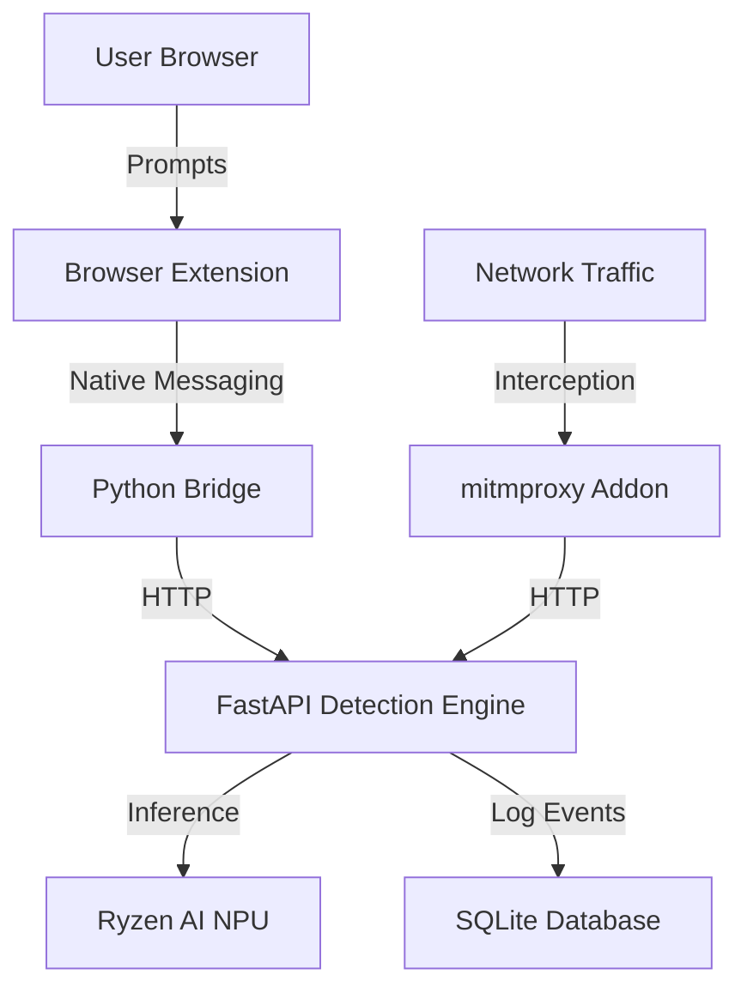

# RyzenShield AI Firewall: Complete Technical Guide

RyzenShield is a hardware-accelerated, privacy-first AI Firewall designed to protect users from prompt injection, jailbreaks, and malicious instructions when interacting with LLMs like ChatGPT and Claude. It leverages the **AMD Ryzen AI NPU** to perform local, near-zero latency threat detection.

---

## 🏗️ Architecture Overview

The system operates across three distinct layers to ensure no malicious prompt reaches the AI provider:



1.  **Browser Extension**: Intercepts `Enter` key presses and "Send" clicks in ChatGPT/Claude.
2.  **Local Proxy (mitmproxy)**: Intercepts network-level API calls to `api.openai.com` and `claude.ai`.
3.  **Detection Engine**: A FastAPI server running a quantized **Prompt Guard 22M** model on the Ryzen AI NPU.
4.  **Database**: Stores all "Block", "Warning", and "Pass" events for audit trails.

---

## 💻 Tech Stack

### Core Components
- **Inference Engine**: Python 3.11+, ONNX Runtime.
- **Hardware Acceleration**: Vitis AI Execution Provider (Ryzen AI).
- **Web Framework**: FastAPI + Uvicorn.
- **Proxy Layer**: mitmproxy.
- **Browser Extension**: JavaScript (Manifest V3).

### ML Model
- **Model**: [Meta Llama Prompt Guard 2 (22M)](https://huggingface.co/meta-llama/Llama-Prompt-Guard-2-22M).
- **Format**: INT8 Quantized ONNX (Optimized for NPU).

### Storage
- **Database**: SQLite3.

---

## 🛠️ Installation Guide

### 1. Model Preparation
Download the quantized model and tokenizer:
```bash
python download_model.py
```
*Note: Requires a Hugging Face token authorized for Meta Llama models.*

### 2. Environment Setup
1.  Create a virtual environment:
    ```powershell
    python -m venv venv
    ```
2.  Activate the environment:
    ```powershell
    .\venv\Scripts\Activate.ps1
    ```
3.  Install the Python dependencies:
    ```bash
    pip install -r requirements.txt
    ```


### 3. Browser Extension & Native Host
1.  Load the `browser_extension` folder in Chrome via **Developer Mode** -> **Load Unpacked**.
2.  Note the **Extension ID**.
3.  Open `browser_extension/native_host/com.ryzenshield.firewall.json`.
4.  Update the `allowed_origins` with your Extension ID: `"chrome-extension://PASTE_YOUR_ID_HERE/"`.
5.  **Register the Host (Windows Admin PowerShell)**:
    ```powershell
    New-Item -Path "HKCU:\SOFTWARE\Google\Chrome\NativeMessagingHosts\com.ryzenshield.firewall" -Value "[YOUR_PATH]\browser_extension\native_host\com.ryzenshield.firewall.json" -Force
    ```

### 4. MITMProxy SSL Certificate
To intercept Claude.ai (HSTS), you must trust the mitmproxy Root CA:
1.  Locate `%USERPROFILE%\.mitmproxy\mitmproxy-ca-cert.p12`.
2.  Double-click -> **Local Machine** -> **Trusted Root Certification Authorities**.
3.  Restart your browser.

---

## 🚀 Running the System

### Step 1: Start Detection Engine
```bash
python detection_engine/app.py
```
Wait for `Engine successfully initialized with model`.

### Step 2: Start Network Proxy
```bash
mitmdump -s local_proxy/proxy_addon.py
```

---

## 🛡️ Security & Hardening Features

-   **NPU Isolation**: All detection happens locally. Your prompts never leave your machine for "safety checks."
-   **Input Validation**: Rejects prompts > 10,000 characters to prevent Memory/DoS attacks.
-   **Fail-Safe Timeouts**: 2.0s timeouts on all internal calls to ensure no lag in your browsing experience.
-   **Numerical Stability**: Softmax calculation hardened against floating-point overflows.

---

## 📊 Monitoring
All events are logged to `shared/firewall.db`. You can view them using any SQLite browser or by checking the terminal output of the detection engine.
